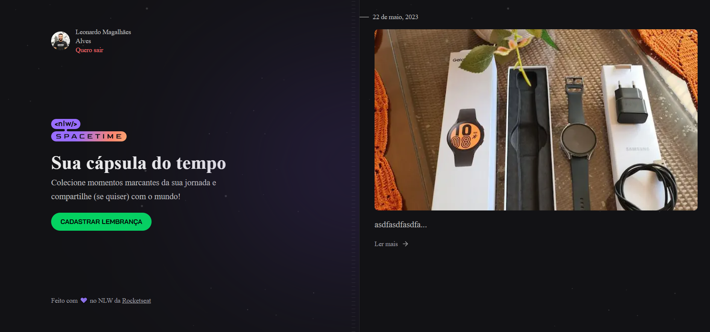

<a name="readme-top"></a>
[![Contributors][contributors-shield]][contributors-url]
[![Forks][forks-shield]][forks-url]
[![Stargazers][stars-shield]][stars-url]
[![Issues][issues-shield]][issues-url]
[![MIT License][license-shield]][license-url]
[![LinkedIn][linkedin-shield]][linkedin-url]


<!-- PROJECT LOGO -->
<br />
<div align="center">
  <a href="https://github.com/LeonardoMagalhaes/NLW-Spacetime">
    
  </a>

<h3 align="center">Spacetime</h3>

  <p align="center">
    This is a module of the NLW Spacetime provided by Rocketseat.
    <br />
    <a href="https://github.com/LeonardoMagalhaes/NLW-Spacetime"><strong>Explore the docs »</strong></a>
    <br />
    <br />
    <a href="https://github.com/LeonardoMagalhaes/NLW-Spacetime/issues">Report Bug</a>
    ·
    <a href="https://github.com/LeonardoMagalhaes/NLW-Spacetime/issues">Request Feature</a>
  </p>
</div>


<!-- TABLE OF CONTENTS -->
<details>
  <summary>Table of Contents</summary>
  <ol>
    <li>
      <a href="#about-the-project">About The Project</a>
      <ul>
        <li><a href="#built-with">Built With</a></li>
      </ul>
    </li>
    <li>
      <a href="#getting-started">Getting Started</a>
      <ul>
        <li><a href="#prerequisites">Pre-requisites</a></li>
      </ul>
    </li>
    <li><a href="#usage">Usage</a></li>
    <li><a href="#license">License</a></li>
    <li><a href="#contact">Contact</a></li>
  </ol>
</details>


<!-- ABOUT THE PROJECT -->
<!-- ## About The Project

![Product Name Screen Shot][product-screenshot]

<p align="right">(<a href="#readme-top">back to top</a>)</p> -->


### Built With


* [![Node][NodeJS]][Node-url]
* [![Expo][ExpoJS]][Expo-url]
* [![Next][Next.js]][Next-url]
* [![Axios][AxiosJS]][Axios-url]
* [![React][React.js]][React-url]
* [![Prisma][PrismaJS]][Prisma-url]
* [![Fastify][FastifyJS]][Fastify-url]
* [![Tailwind][TailwindCSS]][Tailwind-url]
* [![Typescript][TypescriptJS]][Typescript-url]
* [![ReactNative][ReactNativeJS]][ReactNative-url]


<p align="right">(<a href="#readme-top">back to top</a>)</p>


<!-- GETTING STARTED -->
## Getting Started

This is a multipart project. First, initiate the server (instructions are inside it) then start the project you want to work on.

<!-- ```bash
npm start
# or
yarn start
# or
pnpm start
``` -->


### Prerequisites

Run the npm install:
* npm
  ```sh
  npm install npm@latest -g
  ```


<!-- USAGE EXAMPLES -->
## Usage

This is a POC to put in practice new functionalities and studies.

<p align="right">(<a href="#readme-top">back to top</a>)</p>


<!-- LICENSE -->
## License

Distributed under the MIT License. See `LICENSE.txt` for more information.

<p align="right">(<a href="#readme-top">back to top</a>)</p>


<!-- CONTACT -->
## Contact

Project Link: [https://github.com/LeonardoMagalhaes/NLW-Spacetime](https://github.com/LeonardoMagalhaes/NLW-Spacetime)

<p align="right">(<a href="#readme-top">back to top</a>)</p>


<!-- ACKNOWLEDGMENTS -->
<!-- ## Acknowledgments

```js
  npm install nativewind      // Traduz Tailwind para react-native
  npm install tailwindcss -D  // Instala Tailwind para desenvolvimento
  npx tailwindcss init        // Cria o arquivo de configuração do Tailwind

  // Setup tailwindcss configuration: https://www.nativewind.dev/quick-starts/create-react-native-app

  // For typescript configuration, add these lines on tsconfig.json:

  "compilerOptions": {
    "types": [
      "nativewind/types"
    ]
  },

  npx expo install @expo-google-fonts/roboto @expo-google-fonts/bai-jamjuree expo-font   // Instalação das fontes
  npx expo install react-native-svg     // Biblioteca para manipulação de aarquivos SVG
  npm i -D react-native-svg-transformer // Módulo para importação dos arquivos SVG de maneira mais fácil nos componentes.

  npm i axios   // Para comunicação http
  npx expo install expo-secure-store   // Para salvar informações sensíveis no celular

  // Expo router permite usar a mesma estrutura de roteamento do Next.js
  npx expo install expo-router react-native-safe-area-context react-native-screens expo-linking expo-constants expo-status-bar

  npx expo install expo-image-picker   // Biblioteca usada para manuseio de imagens do dispositivo.
```
<p align="right">(<a href="#readme-top">back to top</a>)</p> -->


<!-- MARKDOWN LINKS & IMAGES -->
<!-- https://www.markdownguide.org/basic-syntax/#reference-style-links -->
[contributors-shield]: https://img.shields.io/github/contributors/LeonardoMagalhaes/NLW-Spacetime.svg?style=for-the-badge
[contributors-url]: https://github.com/LeonardoMagalhaes/NLW-Spacetime/graphs/contributors
[forks-shield]: https://img.shields.io/github/forks/LeonardoMagalhaes/NLW-Spacetime.svg?style=for-the-badge
[forks-url]: https://github.com/LeonardoMagalhaes/NLW-Spacetime/network/members
[stars-shield]: https://img.shields.io/github/stars/LeonardoMagalhaes/NLW-Spacetime.svg?style=for-the-badge
[stars-url]: https://github.com/LeonardoMagalhaes/NLW-Spacetime/stargazers
[issues-shield]: https://img.shields.io/github/issues/LeonardoMagalhaes/NLW-Spacetime.svg?style=for-the-badge
[issues-url]: https://github.com/LeonardoMagalhaes/NLW-Spacetime/issues
[license-shield]: https://img.shields.io/github/license/LeonardoMagalhaes/NLW-Spacetime.svg?style=for-the-badge
[license-url]: https://github.com/LeonardoMagalhaes/NLW-Spacetime/blob/master/LICENSE.txt
[linkedin-shield]: https://img.shields.io/badge/-LinkedIn-black.svg?style=for-the-badge&logo=linkedin&colorB=555
[linkedin-url]: https://linkedin.com/in/leonardo-magalhães-alves-b6511153
[product-screenshot]: public/Screenshot.png

[TypescriptJS]: https://img.shields.io/badge/typescript-3178C6?style=for-the-badge&logo=typescript&logoColor=white
[Typescript-url]: https://www.typescriptlang.org
[AxiosJS]: https://img.shields.io/badge/axios-5A29E4?style=for-the-badge&logo=axios&logoColor=white
[Axios-url]: https://axios-http.com/ptbr/
[React.js]: https://img.shields.io/badge/React-20232A?style=for-the-badge&logo=react&logoColor=61DAFB
[React-url]: https://reactjs.org/
[TailwindCSS]: https://img.shields.io/badge/tailwindcss-06B6D4?style=for-the-badge&logo=tailwindcss&logoColor=white
[Tailwind-url]: https://tailwindcss.com
[ReactNativeJS]: https://img.shields.io/badge/reactnative-61DAFB?style=for-the-badge&logo=reacttable&logoColor=white
[ReactNative-url]: https://reactnative.dev
[ExpoJS]: https://img.shields.io/badge/expo-000020?style=for-the-badge&logo=expo&logoColor=white
[Expo-url]: https://expo.dev
[PrismaJS]: https://img.shields.io/badge/prisma-2D3748?style=for-the-badge&logo=prisma&logoColor=white
[Prisma-url]: https://www.prisma.io
[FastifyJS]: https://img.shields.io/badge/fastify-000000?style=for-the-badge&logo=fastify&logoColor=white
[Fastify-url]: https://www.fastify.io
[NodeJS]: https://img.shields.io/badge/node-339933?style=for-the-badge&logo=nodedotjs&logoColor=white
[Node-url]: https://nodejs.org/en
[Next.js]: https://img.shields.io/badge/next.js-000000?style=for-the-badge&logo=nextdotjs&logoColor=white
[Next-url]: https://nextjs.org/ 